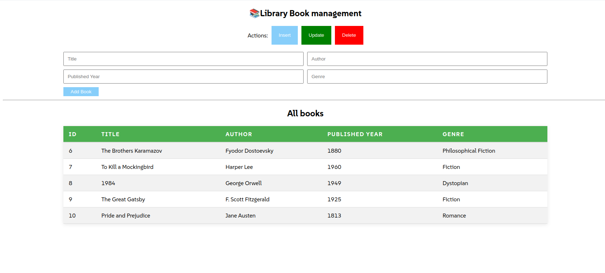

# Library Book Management System

This project is a simple PHP application that allows users to manage a collection of books in a library. It demonstrates how to connect to a MySQL database and perform basic CRUD (Create, Read, Update and Delete) operations using PHP and PDO.

## Features
1. Add a new book: Users can insert new book records into the database.
2. Update book details: Users can update the information of an existing book 3. (title, author, published year, genre).
3. Delete a book: Users can delete a book from the database.
4. List all books: Users can view all books from the database in a table.

## Technologies Used
1. PHP (with PDO for database interaction)
2. MySQL
3. HTML (for forms and displaying data)

## Getting Started
### Prerequisites
1. A web server (e.g., Apache)
2. PHP 7 or above
3. MySQL

## Installation Steps
1. Clone the repository:

```bash
git clone https://github.com/your-username/library-book-management.git
cd library-book-management
```

2. Set up the database:
Create a new database in MySQL called library.
Run the following SQL to create the books table:

```bash
CREATE DATABASE library;

USE library;

CREATE TABLE books (
  id INT AUTO_INCREMENT PRIMARY KEY,
  Title VARCHAR(255) NOT NULL,
  Author VARCHAR(255) NOT NULL,
  Published_year INT NOT NULL,
  Genre VARCHAR(100) NOT NULL
);

```
3. Configure the database connection:

Open dbconnections.inc.php in includes folder and set your MySQL connection details (host, username, password, database).

```bash
<?php
$host = 'localhost';
$db = 'library';
$user = 'your_username';
$pass = 'your_password';

$dsn = "mysql:host=$host;dbname=$db;charset=utf8mb4";

try {
    $pdo = new PDO($dsn, $user, $pass);
    $pdo->setAttribute(PDO::ATTR_ERRMODE, PDO::ERRMODE_EXCEPTION);
} catch (PDOException $e) {
    echo 'Connection failed: ' . $e->getMessage();
}
?>
```

4. Run the project:
```bash
php -S localhost:3000

http://localhost:3000
```
